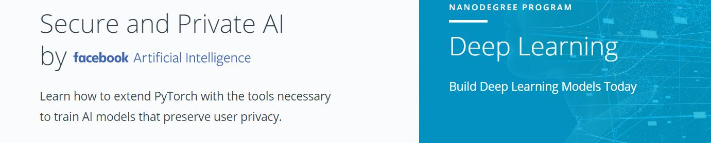

# SECURE AND PRIVATE AI SCHOLARSHIP CHALLENGE

Notebooks for Udacity's Secure and Private AI course.



# IDEA
THE WHOLE IDEA OF DIFFERENTIAL PRIVACY MECHANISM IS TO BLOCK OUT OR FILTER OUT SPECIFIC FEATURES PRIVATE TO SPECIFIC INDIVIDUALS AND ALLOW THE LEARNING PROCESS TO LEARN MORE ABOUT GENERAL CHARACTERSTICS OR FEATURES WHICH IS SAME ACROSS MOST OF THE DATAPOINTS OF THE DATASET.
THIS PREVENTS THE NEURONS OF THE NEURAL NETWORK TO LEARN THE INDIVIDUAL METRICS OF ANY PERSON AND THUS LEARN OVERALL METRICS REQUIRED FOR PREDICTION.
THERE IS A TRADE-OFF BETWEEN PRIVACY PROTECTION AND ACCURACY.
TO IMPLMENET PRIVACY WE ADD NOISE (GAUSSIAN OR LAPLACIAN , TO INPUT OR OUTPUT) AND THERE ARE TWO WAYS TO IMPLEMENT THIS - 
* LOCAL DIFFERENTIAL PRIVACY WHERE WE ADD NOISE TO THE INPUT OF THE DATASET SO THAT CURATOR DOESN'T KNOWS THE EXACT VALUES OF THE ELEMENTS IN THE DATABASE.
* GLOBAL DIFFERENTIAL PRIVACY WHERE THE CURATOR HAS THE RESPONSIBILITY TO ADD THE NOISE AFTER THE QUERY FUNCTION IS RUN OVER THE DATABASE..
IT'S ALL BASED ON WHO TRUSTS WHOM.
ALL THE DETAILED CONCEPTS HAS BEEN INCLUDED IN THE NOTEBOOKS COMMENTS SECTION ITSELF.
FINALLY WE WILL SEE HOW TO IMPLEMENT DIFFERENTIAL PRIVACY IN DEEP LEARNING MODELS.

## Dependencies

To run these notebooks you'll need to install Python 3.6+, PySyft, Numpy, PyTorch 1.0, and Jupyter Notebooks. The easiest way for all of this is to create a conda environment:

```bash
conda create -n pysyft python=3
conda activate pysyft
conda install numpy jupyter notebook
conda install pytorch torchvision -c pytorch
pip install syft
```

SOME OF THE NOTEBOOKS ARE OF ORIGINAL UDACITY'S COURSE AND OTHERS ARE MADE BY ME DURING LEARNING OF THE COURSE.
THE COMPLETED FOLDER CONTAINS ANDREW'S SOLUTIONS AND THE OTHER FILES ARE MY OWN SOLUTIONS/IMPLEMENTATIONS.
ALL THE CODES ARE COMMENTED FOR DETAILED EXECUTION-FLOW OF THE PROGRAMS.
